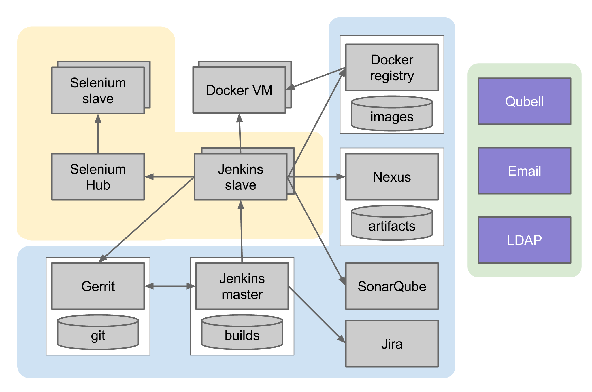
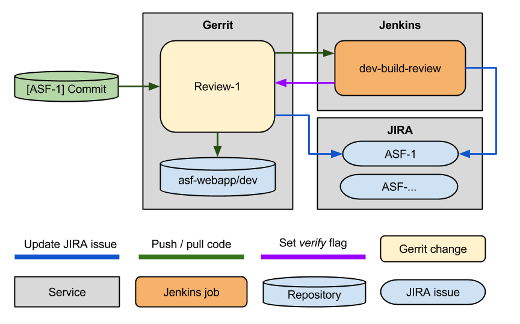
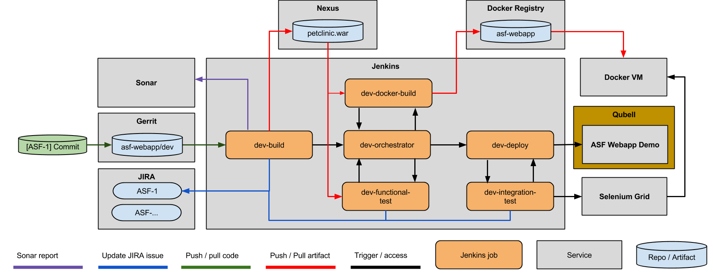

Agile Software Factory
======================

* [Getting Started](#getting-started)
	* [Overview](#overview)
	* [Architecture](#architecture)
	* [CI Workflow](#ci-workflow)
	* [Requirements](#requirements)
	* [Demo application](#demoapp)
* [User Guide](#userguide)
	* [Step-by-step Setup Guide](#step-by-step-setup)
	* [Demo Script](#demo-script)
* [Known Issues](#issues)
* [License and Authors](#license-authors)

# Getting Started

## Overview

Agile Software Factory is the foundation for an efficient, scalable, and reliable development and release process. By modeling processes after a conveyor belt or pipeline, ASF gives structure to your software development process. This allows engineering teams to focus on implementing functionality instead of fighting with operational issues.

## Architecture

Agile Software Factory consists of nine main components:

- **Jenkins** - build, verify code, run code analysis and deploy artifacts into repository
- **Gerrit** - code review tool and source code repository manager
- **LDAP** - centralized store of user accounts information for authentication on other components
- **JIRA** - project management software, aggregates statuses for all other components
- **Nexus** - artifact repository, stores successfully built artifacts from Jenkins
- **Sonar** - collects and analyze code metrics
- **SeleniumGrid** - run integration tests on cluster
- **Docker Registry** - self-hosted docker images repository
- **Docker VM** - instance for deploying CI applications for integration testing

All components of ASF integrated with each other and provide fully working CI pipeline out of the box. List of integrations:

- **Authentication with LDAP** - using LDAP as main authentication provider for all services
- **Automated Jenkins code review** - Automated build and marking `verified -1/+1` each review
- **Gerrit review status in JIRA** - show reviews in following JIRA issues by key in the commit message
- **Jenkins job status in JIRA** -  show job status in following JIRA issues by key in the checkout commit message
- **Email notification** - notify about builds, reviews and JIRA issues status

## CI Workflow

ASF provides CI pipelines for demo Java application. Currently ASF supports 3 main pipelines:

- **Dev Review Pipeline**
    
    For each new opened code review Jenkins checkout code, build it and run unit tests. If tests passed, Jenkins mark change `Verified +1`, else `-1`.
    
    

- **Dev Build Pipeline**

    Each time change submitted to `dev` branch, Jenkins checkout latest `dev` revision and start running full CI pipeline - build code, run unit and functional tests, then upload artifact to Nexus and build docker image based on artifact from Nexus. After docker image deploys to DockerVM and run integration testing against it.
    
    

- **Feature Branch Build Pipeline**

    Implements the same process as *dev build pipeline* with main difference that feature branch build works for branches with `fb-` prefix and starts only manually.

## Requirements

Agile Software Factory requires minimum nine m3.medium AWS instances for infrastructure and one m3.large for Jenkins slave. Estimated costs of infrastructure is $<cost>/month. Currently ASF can be launched **only in us-east** AWS region.

List of required images:

| Name | Image AMI |
|------|-----------|
| CentOS 6.3 x64 | us-east-1/ami-b028aad8 |
| CoreOS-beta-557.2.0 | us-east-1/ami-5e9bd836 |
| asf-jenkins-ubuntu-slave | us-east-1/ami-aacbe6c2 |

All instances required public ips, launching in **VPC currently not supported**.

## Demo application

As a demo application Agile Software factory uses [Spring Petclinic](https://github.com/spring-projects/spring-petclinic) with additional integration tests and deploy scripts. Checkout [ASF-Webapp-Demo](https://github.com/griddynamics/asf-webapp-demo) repo for more info.

## User Guide

### Step-by-step Setup Guide
- **[Step 1. Set up and Configure an Amazon Web Services (AWS) Account](docs/install-guide/step-1.md)**
- **[Step 2. Set up a Qubell Account](docs/install-guide/step-2.md)**
- **[Step 3. Obtain the Agile Software Factory](docs/install-guide/step-3.md)**
- **[Step 4. Launch and post-deployment](docs/install-guide/step-4.md)**

### Demo Script

To show end-to-end working development pipeline we recommend to use our [demo scenario](docs/demo-script.md), that show all features and integrations of Agile Software Factory.

## Known Issues

## License and Authors

Authors:
- Alexey Kornev <akornev@griddynamics.com>
- Grigory Silantiev <gsilantyev@griddynamics.com>
- Nikolay Yurin <nyurin@griddynamics.com>
